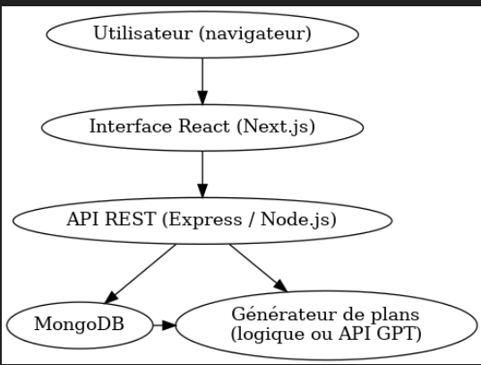
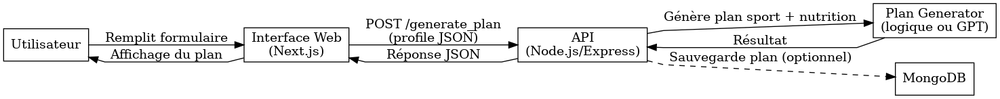
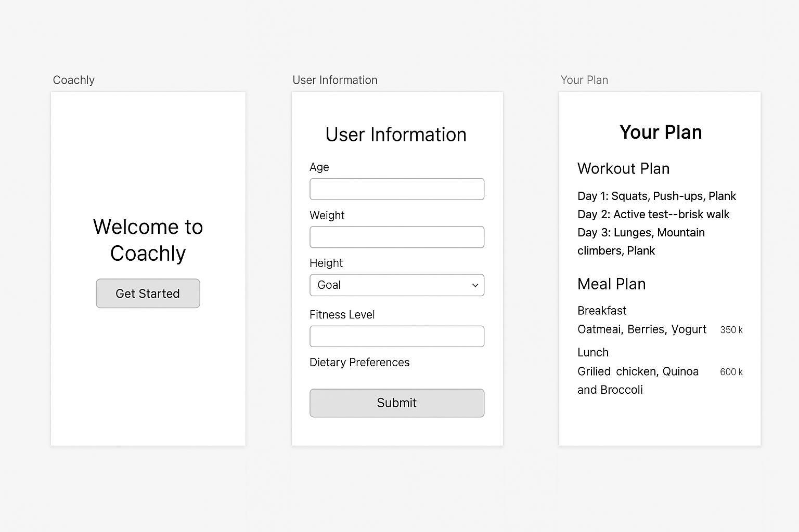

# Coachly – Documentation Technique (Stage 3)

---

## 1. User Stories et Maquettes

### Objectif

Coachly est une application web qui permet de générer un programme d'entraînement et un plan nutritionnel personnalisés à partir des informations renseignées par l’utilisateur. L’objectif est de proposer un outil simple, pratique et rapide à utiliser, sans inscription obligatoire ni besoin de coach.

### User Stories

Les fonctionnalités ont été priorisées avec la méthode MoSCoW.

#### Must Have
- En tant qu’utilisateur, je veux pouvoir entrer mon âge, poids, taille, sexe, niveau sportif et objectif, pour que le programme s’adapte à mon profil.
- En tant qu’utilisateur, je veux recevoir un programme d'entraînement détaillé sur plusieurs jours, pour savoir quoi faire concrètement.
- En tant qu’utilisateur, je veux obtenir un plan nutritionnel adapté à mes préférences et à mon objectif (perte de poids, prise de muscle...), pour mieux structurer mes repas.

#### Should Have
- En tant qu’utilisateur, je veux pouvoir préciser si je suis végétarien ou végan, pour que les suggestions alimentaires respectent mes choix.
- En tant qu’utilisateur, je veux pouvoir régénérer mon plan si celui généré ne me convient pas.

#### Could Have
- En tant qu’utilisateur, je voudrais sauvegarder mon plan pour pouvoir le consulter plus tard.
- En tant qu’utilisateur, je voudrais partager mon plan avec un ami ou sur les réseaux sociaux.

#### Won’t Have (MVP uniquement)
- Suivi de la progression ou journal d’activité → fonctionnalités prévues dans une version future.

### Maquettes (Figma)

1. Accueil : présentation de Coachly, bouton "Commencer"
2. Formulaire utilisateur : saisie des infos physiques + préférences alimentaires
3. Résultat :
   - Bloc 1 : Programme sportif
   - Bloc 2 : Plan nutritionnel
   - Boutons : "Nouveau plan", "Télécharger"

---

## 2. Architecture Système

- Front-end : Next.js + Tailwind CSS
- Back-end : Node.js (API REST avec Express)
- Base de données : MongoDB
- IA : logique simple + possible intégration GPT
- Déploiement : Vercel + Render/Railway



---

## 3. Composants, classes et base de données

### Front-end
- `UserForm`
- `PlanResult`
- `Header`, `Footer`, `Loading`, `ErrorDisplay`

### Back-end
- `POST /generate_plan`
- (futur) `POST /save_plan`

### Base de données MongoDB – Collection plans
```json
{
  "_id": "ObjectId",
  "userId": "ObjectId",
  "createdAt": "2025-07-03T20:10:00Z",
  "profile": {
    "age": 28,
    "weight": 75,
    "height": 180,
    "goal": "fat_loss",
    "level": "beginner",
    "diet": "omnivore"
  },
  "workout_plan": [...],
  "meal_plan": [...]
}
```

### Classe JS
```js
class PlanGenerator {
  constructor(profile) { ... }
  generateWorkoutPlan() { ... }
  generateMealPlan() { ... }
  generate() { ... }
}
```

---

## 4. Diagramme de Séquence

### Cas d’usage : Génération d’un plan personnalisé

1. L’utilisateur remplit le formulaire
2. Requête POST vers l’API
3. Traitement des données côté serveur
4. Génération du plan
5. Réponse envoyée au front
6. (optionnel) Sauvegarde en base
7. Affichage du plan



---

## 5. Spécifications des APIs

### API interne – Coachly

#### `POST /generate_plan`
- Input : profil utilisateur
- Output : plan sportif + nutrition

#### `POST /save_plan` *(optionnel)*
- Sauvegarde du plan en base
- Authentification requise

### API externe potentielle : OpenAI GPT (future version)

---

## 6. Plan SCM et QA

### SCM (Git + GitHub)
- `main`, `dev`, `feature/xxx`
- PR, commits clairs, merges organisés

### QA
- Tests unitaires : Jest (backend)
- Tests API : Postman
- Tests manuels : flows critiques

---

## 7. Justifications techniques

- **Next.js** : simplicité, SSR, déploiement facile (Vercel)
- **Tailwind** : design rapide et responsive
- **Node.js + Express** : stack JS homogène, rapide à mettre en place
- **MongoDB** : flexible et adapté au MVP
- **GPT** (plus tard) : pour enrichir les suggestions de plans
- **Déploiement** : Vercel (front), Render/Railway (back)


### 📱 Maquettes (wireframes Figma)


